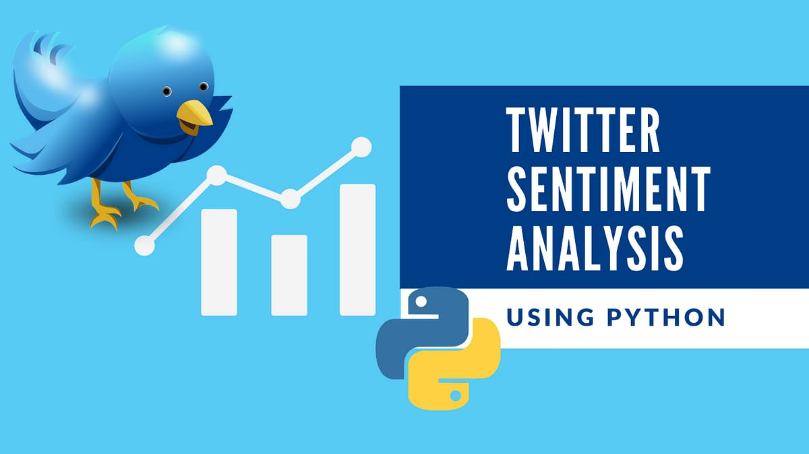

 
# Twitter Sentiment Analysis App 😄😞😐❓
 
 

## About
**A sentiment analysis application built using Streamlit( An open source framework to build web applications in python )**

This is a Streamlit-based web application that performs sentiment analysis on Twitter data. The app allows you to enter a Twitter username or a specific keyword/topic and retrieves recent tweets related to the input. It then analyzes the sentiment of those tweets and provides an overall sentiment whether the tweet  is positive,negative,neutral or irrelevant

 
 

## Live Link
**Hosted on streamlit**

### 🔗 https://mylink
 
 

 

## Features

- Input a Twitter handle or hashtag to retrieve recent tweets.
- Perform sentiment analysis on the retrieved tweets.
- Visualize the sentiment distribution using pie charts or bar plots.
- Display the most frequently used words in positive and negative tweets.
- Explore the sentiment analysis results and gain insights.

 

## Model and Dataset
The sentiment analysis model is trained using logistic regression on a labeled dataset of tweets. The dataset consists of tweets collected from various sources and manually annotated with sentiment labels. The logistic regression model is used to predict the sentiment of new, unseen tweets.

## Technologies Used

- Python
- **Web Framework** :- Streamlit(A Python framework for building interactive web applications)
- **Libraries for sentiment analysis** :- NLTK(Natural Language Toolkit for text processing and sentiment analysis)
- Scikit-learn: Used for training the logistic regression model and performing sentiment analysis.
- Pandas: Used for data manipulation and analysis.
- Matplotlib and Seaborn: Used for data visualization.

# Sample Results

## for positive sentiment 😄

## for negative sentiment 😞

## for neutral sentiment 😐

## for Irrelevant sentiment ❓

## Thank You!
Thank you. **I hope you liked the project**.

